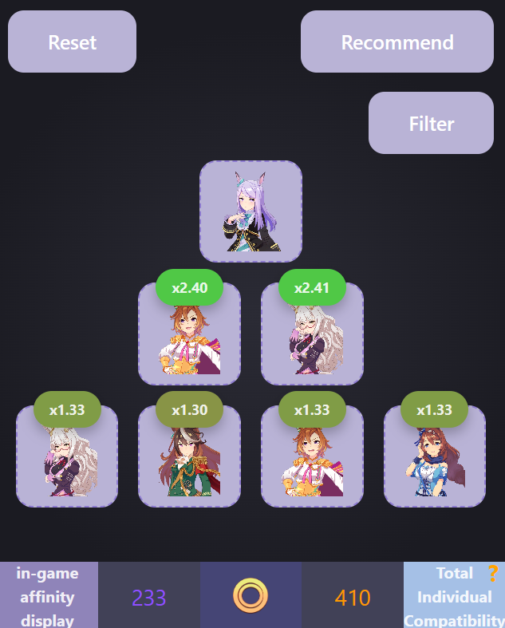

# UmaBreeder
UmaBreeder is a web application designed to help players of **Uma Musume: Pretty Derby** build optimal lineage trees by calculating affinity, compatibility and recommending the best character combinations.

It simplifies lineage planning by analyzing in-game base affinity and overall compatibility between characters.



---

##  Features

- Select individual characters for each slot in the lineage tree
- Calculate in-game base affinity
- Calculate compatibility for each character slot
- Automatically recommend optimal lineage trees. Fill blank character slots for best total compatibility
- Filter characters when generating recommendations

---

## Tech Stack

- **Framework:** Svelte
- **Language:** TypeScript
- **Build Tool:** Vite
- **Package Manager:** npm

---

## Getting Started

1. Clone the repository
```bash
git clone https://github.com/VuLeDuy1/umabreeder.git
cd umabreeder
```
2. Install dependencies: `npm install`
3. Run server: `npm run dev`

## Enjoy
